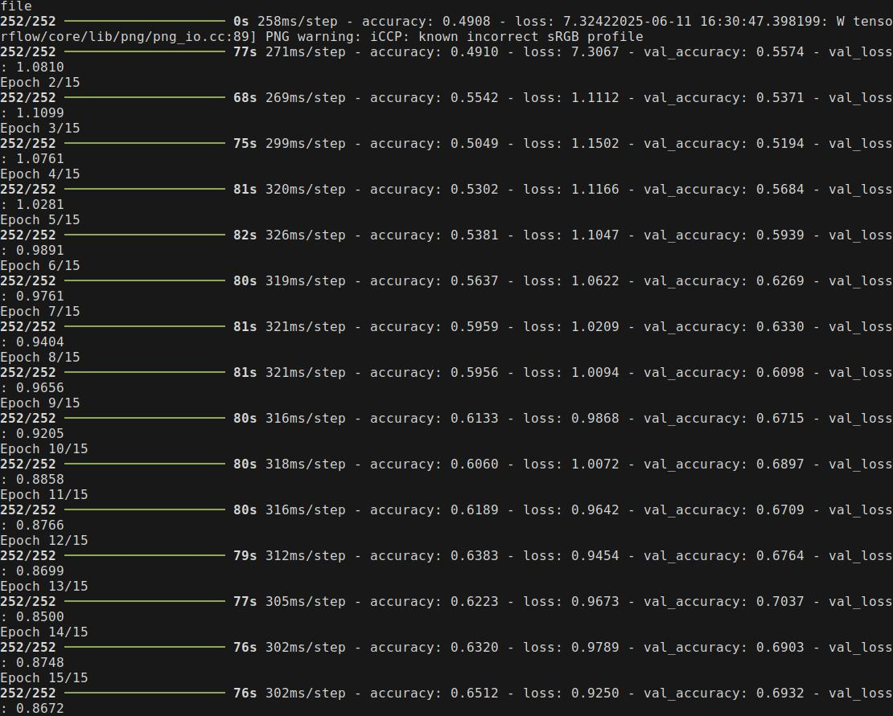

### ML Classification Using TensorFlow
This repository contains a simple example of a machine learning classification task using TensorFlow. The code demonstrates how to build, train, and evaluate a neural network model for classifying data. The model tries to detect various classes like `bird`, `flower`, `human`, `elephant`, `car`.

#### Requirements
- Python 3.x
- TensorFlow
- NumPy
- Matplotlib

#### Dataset Prepapration
Github doesn't allow me to upload all of the data used for the project, but you can download the dataset from kaggle. Also I can share my drive link if needed.
The dataset is expected to be in a directory structure where each class has its own subdirectory containing images. The directory structure should look like this:

```
datasets/
    ├── Bird/
    │   ├── image1.jpg
    │   ├── image2.jpg
    │   └── ...
    ├── Flower/
    │   ├── image1.jpg
    │   ├── image2.jpg
    │   └── ...
    ├── Human/
    │   ├── image1.jpg
    │   ├── image2.jpg
    │   └── ...
    ├── Elephant/
    │   ├── image1.jpg
    │   ├── image2.jpg
    │   └── ...
    └── Car/
        ├── image1.jpg
        ├── image2.jpg
        └── ...
```

There are some scripts to download dataset from kaggle and utilities to rename files etc.
```bash
# to rename files in a directory 
./scripts/file_rename.sh <directory_path>
```

```python
# this utility script downloads and saves the dataset from kaggle to a current directory
python download_dataset.py

```

#### Usage
To run the streamlit web app that uses the model for classification, use the following command:
```
streamlit run main.py
```

#### Training Graph and Results



